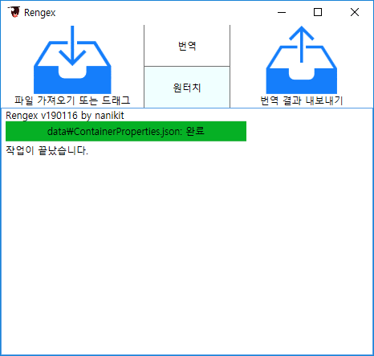

# Rengex

텍스트 파일의 일부분만 추출해 번역하는 툴입니다. 기계 번역 엔진으로 Ehnd를 사용헙니다. 사용 전에 Ehnd를 설치해주세요.

범용으로 만들었지만 때문에 전용 툴보다 실제 적용엔 어려울 수 있습니다.

## 텍스트 파일 번역법

1. 프로그램 창에 번역할 파일 및 폴더를 드래그합니다.
2. `<실행파일 경로>/rengex/4_result`에 번역 파일이 나옵니다.

한 번 번역할 파일을 선택한 후엔 버튼을 클릭해서 작업할 수 있습니다.

정규식 설정파일로 파일의 일부분만 추출해 속도 향상 및 파일 보존이 가능합니다. 자세한 사용법은 아래에 있습니다.

## 프로젝트 폴더 구조

아래 경로에 있는 파일들은 그냥 프로그램에 드래그해도 폴더 구조를 보존해줍니다.

드래그 할 때 자동으로 결과물을 만들어 주는 게 싫다면 버튼을 우클릭해 기본 행동을 바꿀 수 있습니다.

### 1_source/번역파일명
번역파일을 드래그하면 기본으로 그 파일을 복사해옵니다.

### 2_meta/번역파일명.meta.txt
원본 파일에 번역을 적용할 때 필요한 추출 텍스트의 위치와 길이입니다.
일단 수정은 가능하도록 위치,길이의 텍스트 파일로 되어있습니다.

### 3_translation/번역파일명.tran.txt, tran_번역.txt
복사한 번역파일에서 추출한 번역 대상 텍스트입니다. 손번역 시 이 파일을 번역하면 됩니다.

기계 번역을 사용할 시 '_번역'이 이름 뒤에 붙은 파일이 생성되고
병합 시 이 파일을 우선합니다.

### 4_result/번역파일명
내보내면 이 경로에 결과파일이 저장됩니다.

## 설정 파일

.gitignore와 유사하게 1_source 폴더 안에 설정 파일을 넣으면 그 폴더와 하위 폴더 안에서
해당 파일의 이름으로 끝나는 파일 전부에 설정을 적용합니다.
하지만 가장 연관이 큰 파일 하나만 적용됩니다.

### *.match.txt

가져오기 단계에서 추출할 텍스트의 정규식 파일입니다.
기본값으로 파일 전체를 번역합니다.

파일 전체가 하나의 정규식이고, #으로 시작하는 줄은 주석으로 처리됩니다.

(?<영문이름>)으로 감싼 그룹의 내용만 추출합니다.
비공식적으로 정규식 그룹 이름 뒤에 F를 붙이면 정규식 함수가 되고, C를 붙이면 그룹을 캡처하진 않지만 그룹 내용을 정규식 함수로 다시 매칭을 한 번 시도합니다. CC를 붙이면 여러 번 매칭을 시도합니다.

### *.repla.txt

번역 전, 후의 텍스트를 치환하는 정규식 설정 파일입니다.

첫째는 패턴 정규식입니다. 찾은 모든 해당 패턴을 치환합니다.
패턴 시작 부분에 (?=)(?:)를 붙일 수 있습니다.
(?=)는 번역 전의 치환 규칙(이하 전처리)임을 의미합니다.
(?:)는 전처리에선 "그룹이름\0"을, 후처리에선 "그룹이름\0원문\0"을 앞에 붙여달라는 것을 의미합니다.

둘째는 치환 정규식입니다. $1등으로 이전 문자열 보존이 가능합니다.
빈 문자열을 넣고 싶으면 비우지 말고 $을 적습니다.

*[파일경로]인 줄은 해당 위치에서 다른 설정파일을 적용합니다.
치환은 한 패턴이 성공하더라도 전부 수행됩니다.

## 건의 방법

수정을 원하는 부분이 있으면 이슈로 올리시거나 [메일](mailto:kitnani@yandex.com)을 보내주시면 보겠습니다.

## 같이 쓰면 유용한 프로그램

### [AgentRansack](https://www.mythicsoft.com/agentransack/)

기계 번역을 돌렸는데 규칙이 잘못되어 일부 파일만 다시 번역해야 할 수 있습니다.

이 때 오염된 원문이나 번역문을 알고 있다면 위 프로그램으로 문자열 검색을 하고 걸린 파일들을 Rengex에 드래그하면 다른 파일에 드는 번역 시간을 절약할 수 있습니다.

### [WinMerge](http://winmerge.org/)

파일을 비교하는데 vscode의 파일 비교도 괜찮지만 이 프로그램은 폴더 단위 비교와 3파일 비교가 가능한 점이 유용합니다.
